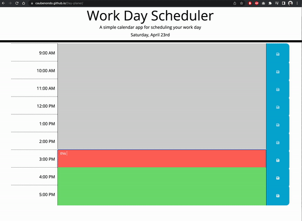

# Day-planer
### Project 05: Day Planner
### Author: Hai Duong
#### [Demo Link](https://caubenondo.github.io/Day-planer/)
#### Description:
This is a simple calendar application that allows a user to save events for each hour of the day by modifying starter code. This app will run in the browser and feature dynamically updated HTML and CSS powered by jQuery.

Beside jquery and CSS bootrap, I used [Moment.js](https://momentjs.com/) library to work with date and time.

#### How the app works
```
- Current day is displayed at the top of the calendar
- Scroll down for Daily Planner
- Daily planner present hour blocks from 9:00am to 5:00pm
- Depend on curent time of the day, the planner will will show different background textarea
    - Grey background for past hours
    - Red background for current hour
    - Green background for future hours
- You then will add notes to block hour's textarea
- Click save icon to save the notes in local storage, so the notes will display the same info after you refresh browser
- If you dont click save icon after you add changes, the note will not be saved and the planner will show previous note after you refresh your browser
```

#### App in action
